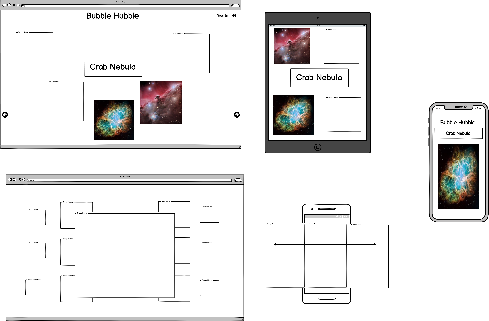
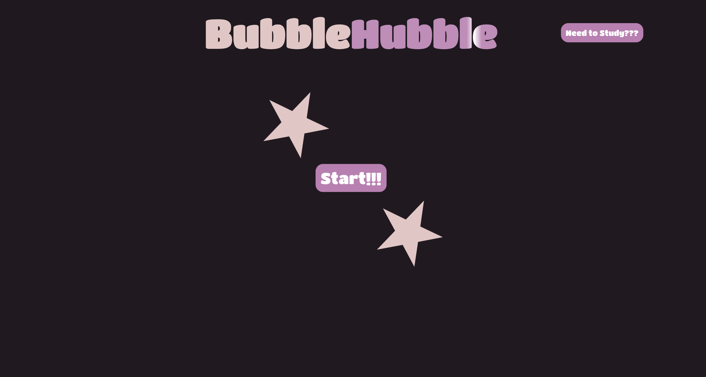
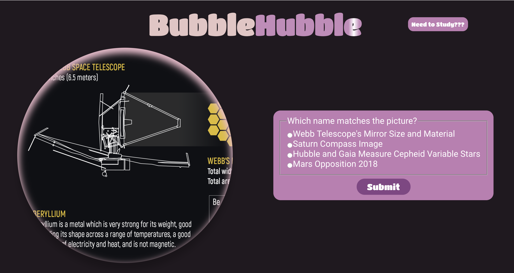
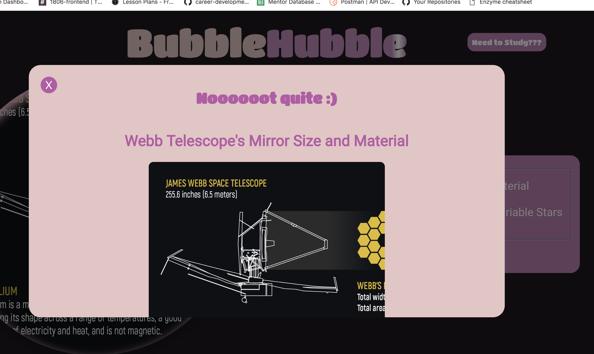
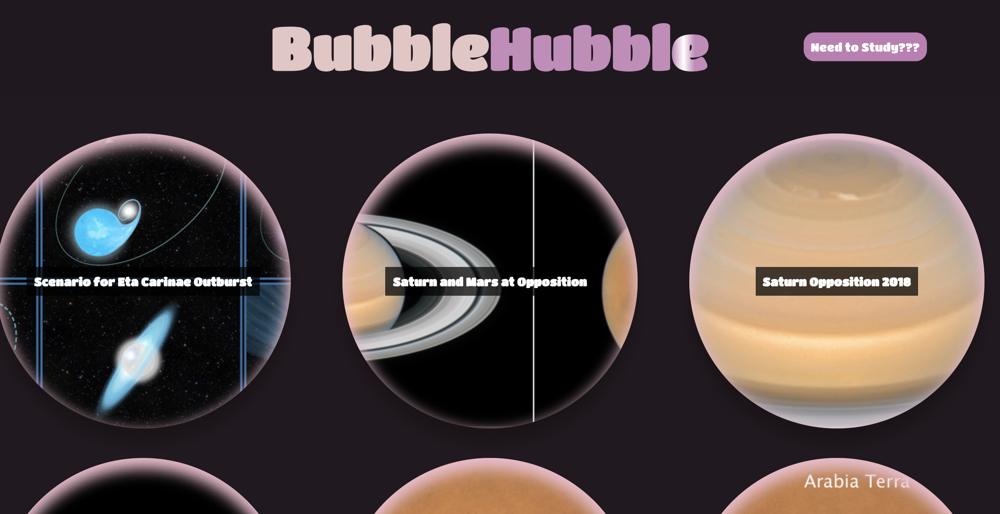
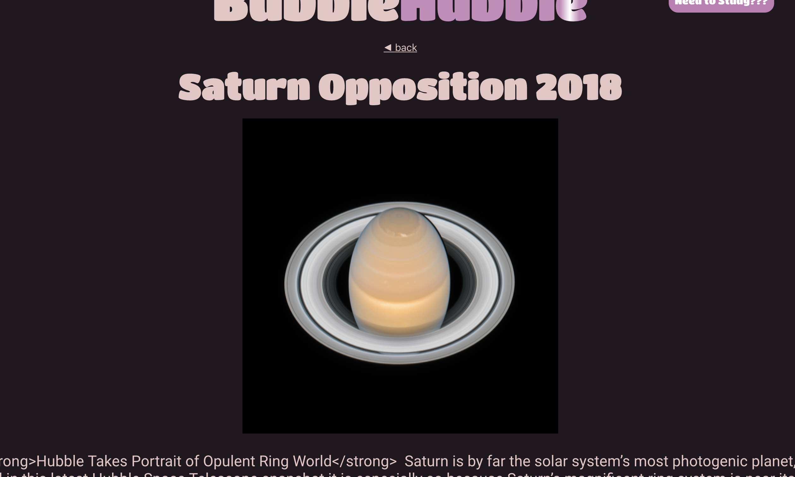

# Bubble Hubble

Time: One Week
API: Hubble Satellite
Audience: Elementary School Kids

Welcome to the endless expanse of space. At Bubble Hubble learning is GAMEFIED so your child can learn the road maps of the cosmos with ease.

### See it Live
[Check it Out](https://salamandastron1.github.io/hubble-bubble)

### APIs used
* Hubble telescope archives @ hubblesite.org/api/

### Primary Technologies
* React
* Redux
* React-Router

### SetUp

In the project directory, you can run:

1. Clone down repo
2. `npm install` from root directory
3. `npm start` and visit `localhost:3000` in your browser

### Test Driven Development

Bubble Hubble uses Jest and Enzyme for all testing purposes

`npm test` from the associated root directory

### ScreenShots

#### Wireframe

#### Actual Screenshots

### Original Assignment

[Self-Directed Project](http://frontend.turing.io/projects/self-directed-project.html)

### Contributors

Tim Garrity: [Github](https://github.com/Salamandastron1) 
